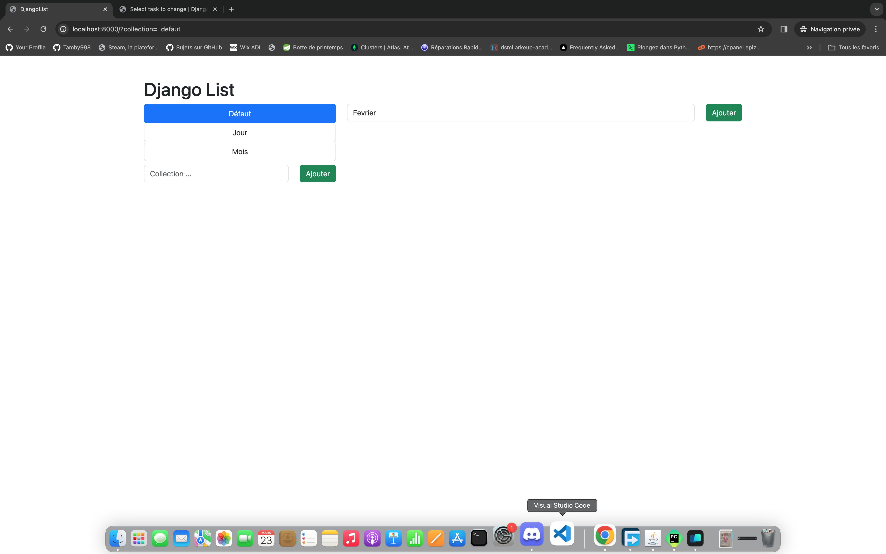
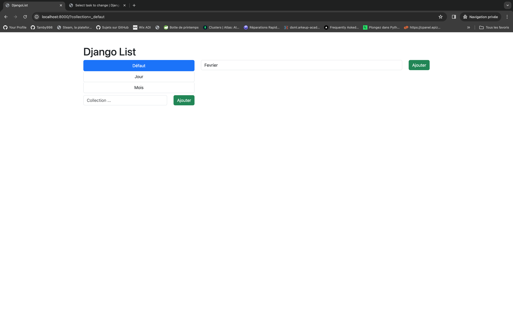

# **Django Todo List**

## **Modèles** 

- Collection 
  - name
  - slug
- Tasks
  - description
  - collection (ForeignKey)

## **Fonctionnalités**  

[x] Ajouter une collection  
[x] Supprimer une collection  
[x] Empêcher l'ajout d'une collection en doublon   
[x] Ajouter une tâche (reliée à une collection)  
[x] Supprimer une tâches  
[x] Afficher les tâches d'une collection

## **Réalisation**

Voici le résultat final de notre application

    
   
